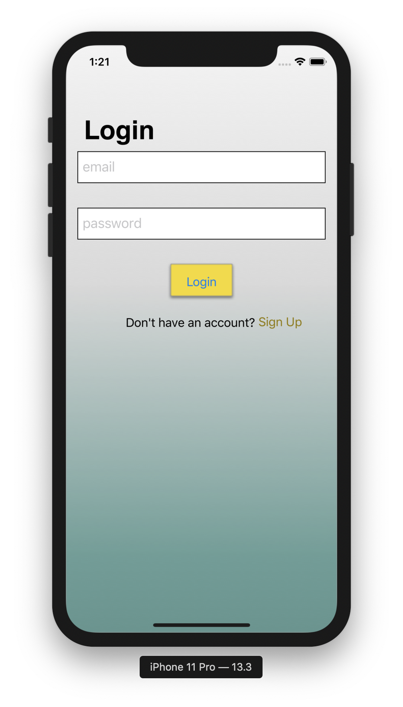
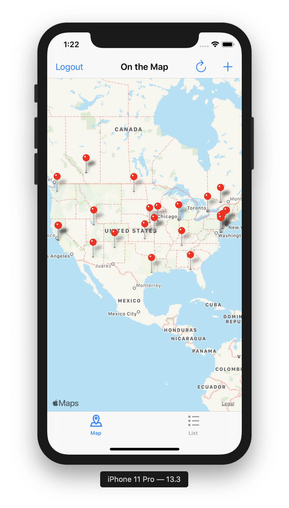
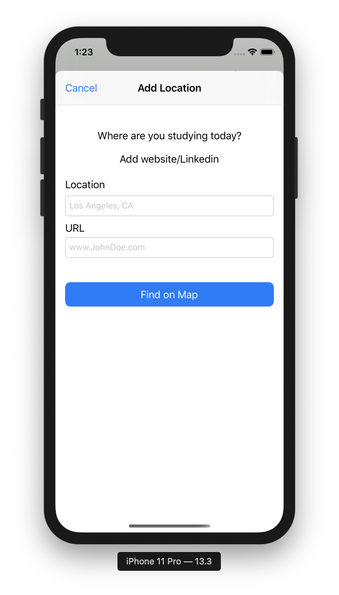
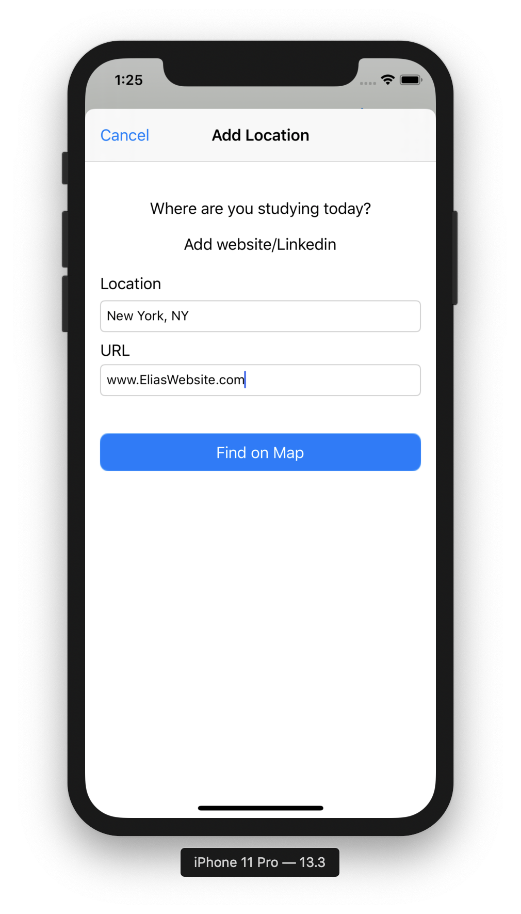
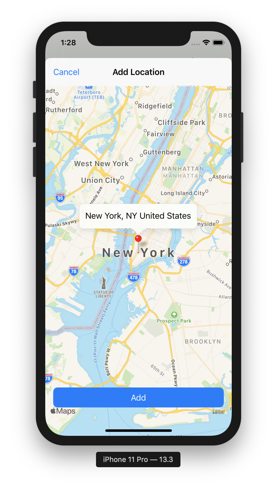
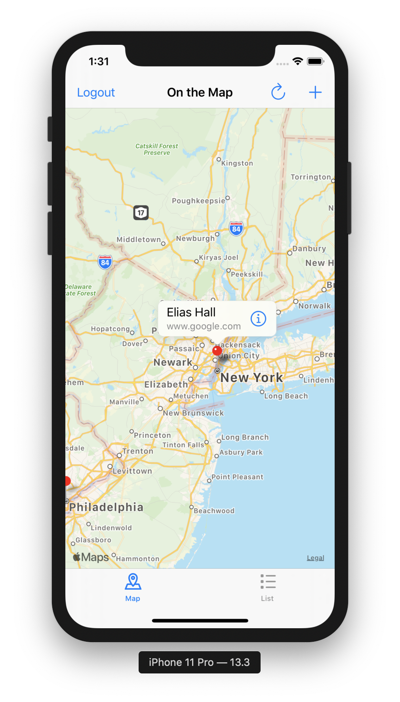
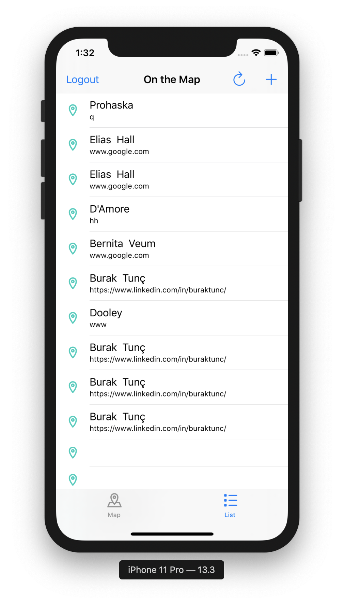

# MapApp, iOS Developer: Elias.H

**Run instructions:** 
Xcode 10.3, iPhone XS, portrait only, user needs a working username and password at login screen for further access.

**Important concepts used:** Authentication, API Network calling(ex. GET/POST), Geocoding

**Overview:**
This app allows user to share name and a url with other users. User adds to database, where other users can download and see last 100 entries.

**Walkthrough:**
User enters username and password at login screen to gain access. User can tap on 1 of the last 100 pins that were downloaded to see annotation. User can select information icon to go to the url that is part of the annotation. User can select tableview tab to see downloaded pins in tableview format. When user is in tableview if they select a cell they will go to the url via Safari. If user wants to refresh information for latest 100 pins they can tap the refresh button. If user wants to add their pin, they tap the add/plus button, then find their location, then add their location to database. Users pin will appear on map/tableview on refresh. User has option to logout.

**Tools used:**
**Xcode 10.3, iPhone XS, UIKit, MapKit, CoreLocation**

**Select below for larger clearer images**

